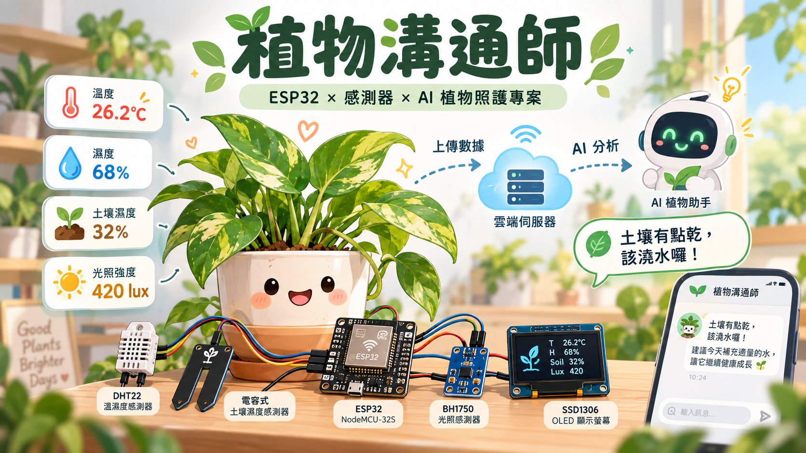
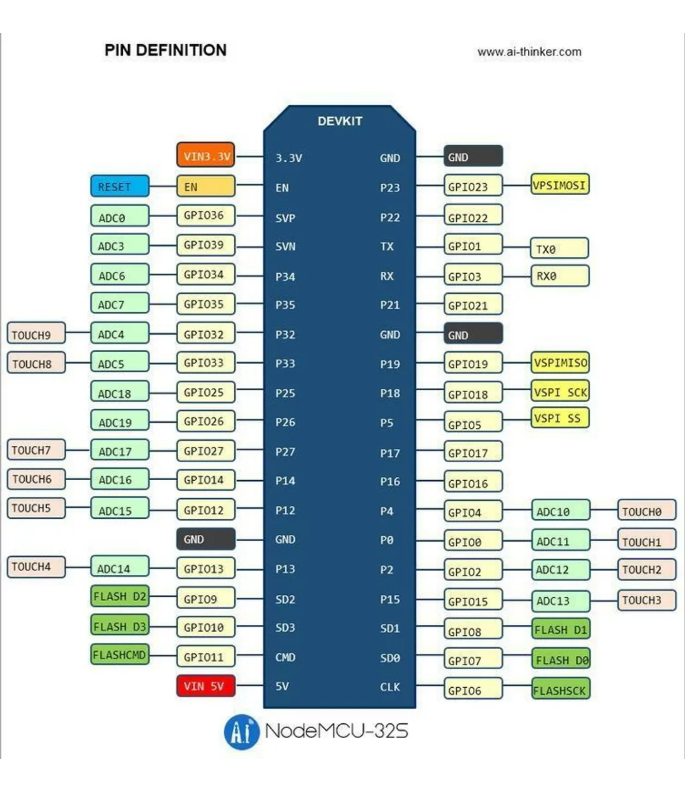
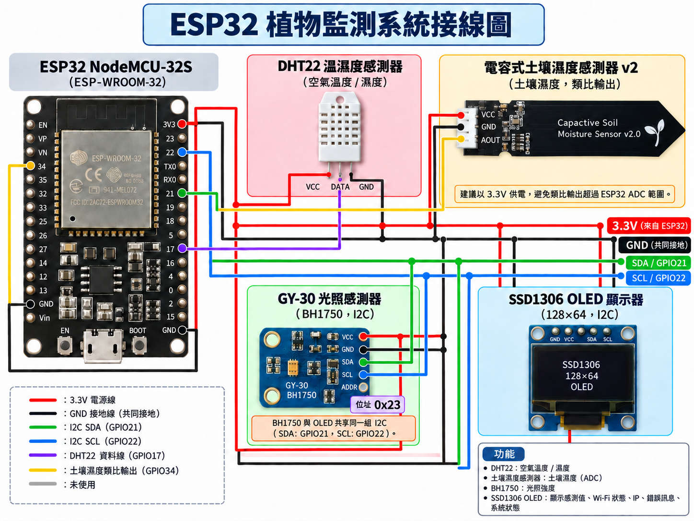
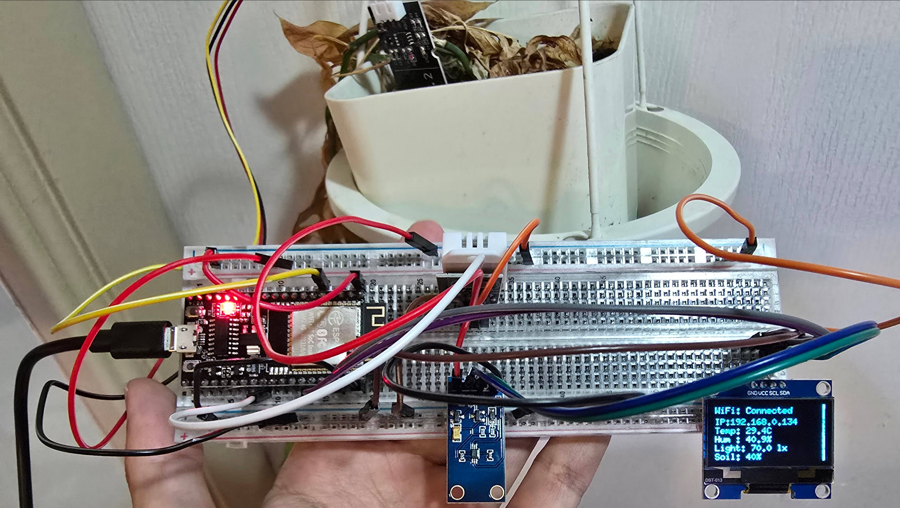
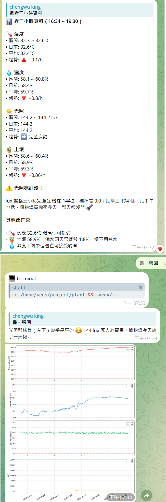

# 植物溝通師 🌿

利用 ESP32 + 感測器收集植物的環境數據，並透過 AI 模型分析這些數據，提供植物健康狀態的建議與警示。

IDE 使用 arduino IDE，程式語言使用 C++。

個人無 C++ & Arduino 經驗，透過 AI 輔助完成創意發想。

### Arduino IDE 初始設定

NodeMCU-32S 使用 ESP32 晶片，第一次使用 Arduino IDE 時需要安裝 ESP32 開發板支援套件；感測器本身通常不需要另外安裝硬體 driver，但程式需要使用對應的 Arduino 函式庫。

1. 在 Arduino IDE 的「檔案 > 偏好設定」中，將下列網址加入「其他開發板管理員網址」：
   `https://espressif.github.io/arduino-esp32/package_esp32_index.json`
2. 開啟「工具 > 開發板 > 開發板管理員」，搜尋並安裝 `esp32`（Espressif Systems）。
3. 在「工具 > 開發板」選 `ESP32 Dev Module`。
4. 用 USB 連接開發板後，在「工具 > 連接埠」選擇對應的連接埠。

到「工具 > 管理程式庫」安裝程式會用到的函式庫：

- DHT22：`DHT sensor library`（Adafruit），並一併安裝相依的 `Adafruit Unified Sensor`
- GY-30（BH1750）：`BH1750`（常見版本為 Christopher Laws）
- SSD1306 OLED：`Adafruit SSD1306`，並一併安裝相依的 `Adafruit GFX Library`
- 土壤濕度感測器使用 ESP32 的 ADC 類比輸入，不需要額外函式庫

BH1750 與 SSD1306 都使用 I2C；ESP32 開發板支援套件已提供 I2C 功能，不需另裝 driver。安裝函式庫時若 Arduino IDE 提示安裝相依套件，請一併同意安裝。

## 硬體

蝦皮都可買到，這邊儘量列出型號，可以直接搜尋購買。

加上擴展版 or 麵包版跟杜邦線，硬體成本大約在 $1,000 上下。

### 開發板

- NodeMCU-32S

順便買擴展板的接線會輕鬆很多。

接線記得參考購買時的商品腳位圖，下圖爲範例參考，實際請依照購買的商品腳位圖接線。

### 感測器

#### DHT22
用途：
- 空氣溫度
- 空氣濕度

#### Capacitive Soil Moisture Sensor v2
用途：
- 土壤濕度
備註：
- 使用 ADC 類比輸入

*[正式使用前要先手動校正感應器數值](soil_sensor/soil_sensor.ino)*

#### GY-30（BH1750）
用途：
- 光照強度
備註：
- I2C 通訊

### 顯示器

#### SSD1306 OLED（128×64）

方便 debug 用，脫離電腦接線狀態能看到基本log。

用途：
- 顯示目前感測值
- 顯示 Wi-Fi 狀態
- 顯示 IP
- 顯示錯誤訊息
- 顯示系統狀態
備註：
- I2C 通訊

#### 最終接線圖

## Server

將感測器數據傳送到 Server 端。使用 GCP 的 Cloud Run (server) + Firestore (db)
以資料收集的頻率這兩個服務的免費額度就足夠使用。但可能需要微量的流量費。

### cloud run

使用 FastAPI 建立 Server，收到資料後寫入 Firestore。

程式參考 [main.py](plant_monitor_server/main.py) 與 [requirements.txt](plant_monitor_server/requirements.txt)。

### firestore

NoSQL 資料庫，連 schema 都可以不用定義，方便。

## AI agent

偷懶使用 Hermes Agent，模型看自己要用哪種。我將 GCP credentials.json 及 Query firestore 的程式碼放在 Hermes 可存取位置，Hermes 會自己使用程式去撈需要資料。
植物種類就靠使用者輸入;有種類盆栽大小後寫入 SKILL，Hermes 就能自己撈資料並根據植物種類及盆栽大小提供建議。
訊息平臺則使用 telegram，搭配 personality kawaii 會非常好玩。

### tools

給 Hermes Agent 使用的工具，主要是查詢 Firestore 的資料。
查詢出來的資料會經過 pandas DataFrame 預處理，避免大量混雜資料反而塞爆 context，方便 LLM 模型直接取得趨勢分析。

SKILL instructions.md 參考 [instructions.md](hermes_tools/instructions.md)
讀取工具的程式碼參考 [hermes_tools.py](hermes_tools/tools.py)

#### 串接 telegram 後畫面

## 後續發展應用

整合更多感測器，但是便宜的感測器都買了剩下的都有點貴。 

整合圖片功能，使用 ESP32-CAM 拍攝植物照片，並使用 AI 模型分析植物的健康狀態。
- 不過同時也要模型本身能解讀照片，目前我用的模型僅支援文字，暫無擴展計劃。

客製化電路板轉換成可愛外形，搭配手機 APP，產品化這個專案。(誠徵股東)
